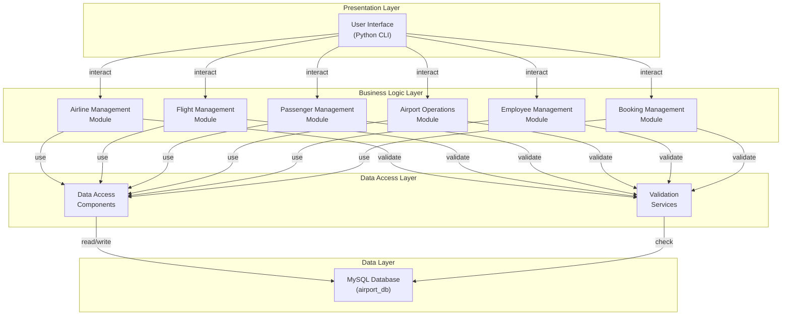

# Logical Architecture Diagram - AMS

## System Components and Relationships

## Component Responsibilities

### 1. **Airline Management Module**
- Add/Update/Delete airlines
- Track aircraft inventory
- Manage airline details
- Status tracking

### 2. **Flight Management Module**
- Create routes and flights
- Manage flight schedules
- Track flight status
- Stopover management

### 3. **Passenger Management Module**
- Register passengers
- Manage passenger records
- Emergency contacts
- Nationality tracking

### 4. **Airport Operations Module**
- Manage airport details
- Runway management
- Terminal operations
- Capacity tracking

### 5. **Employee Management Module**
- Airline crew management (Pilots, Attendants, Engineers)
- Airport staff management (ATC, Security, Management)
- Language proficiency tracking
- Experience tracking

### 6. **Booking Management Module**
- Create bookings/reservations
- Generate boarding passes
- Assign seats
- Special services (Wheelchair, XL seats, etc.)
- Luggage tracking

## Architectural Issues Identified

### Tight Coupling
- Business logic directly coupled with data access
- No clear separation of concerns
- UI logic mixed with business logic

### God Classes
- Each module handles too many responsibilities
- Monolithic functions doing multiple operations

### Missing Layers
- No service layer for business logic isolation
- No repository pattern
- No dependency injection

## Refactoring Recommendations

1. **Introduce Service Layer**
   - Business logic isolation
   - Reusable components

2. **Implement Repository Pattern**
   - Abstract data access
   - Easier testing

3. **Separate Concerns**
   - Input validation → Validation service
   - Database operations → Data access layer
   - Business logic → Service layer

4. **Apply Design Patterns**
   - Factory pattern for object creation
   - Dependency injection
   - Facade pattern for complex operations
