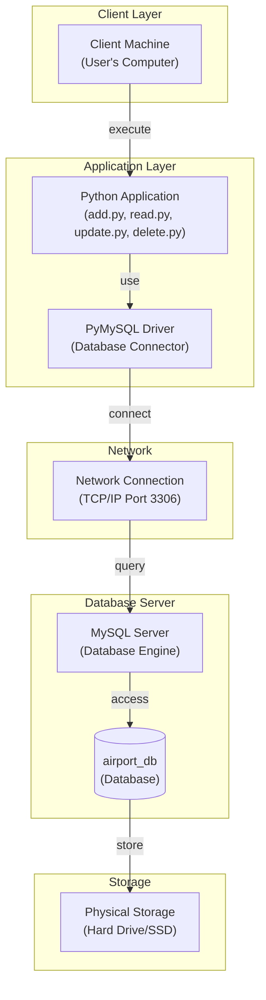

# Physical Architecture Diagram - AMS

## System Deployment and Infrastructure



## Deployment Components

### 1. **Client Tier**
- **Location**: User's computer
- **Component**: Python CLI application
- **Responsibility**: User interaction, input handling

### 2. **Application Tier**
- **Component**: Python Scripts
  - `add.py` - Create operations
  - `read.py` - Retrieve operations
  - `update.py` - Modify operations
  - `delete.py` - Remove operations
  - `extra.py` - Additional features
  - `miniworld.py` - Test data generator

- **Database Driver**: PyMySQL
  - Establishes connection to MySQL
  - Executes SQL queries
  - Handles result fetching

### 3. **Network Tier**
- **Protocol**: TCP/IP
- **Port**: 3306 (MySQL default)
- **Connection Type**: Local or Remote
- **Latency**: Depends on network

### 4. **Database Tier**
- **DBMS**: MySQL Server
- **Database**: airport_db
- **Tables**: 30+ tables
- **Storage Engine**: InnoDB (default)

### 5. **Storage Tier**
- **Physical Media**: Hard Drive / SSD
- **Data Persistence**: Permanent storage
- **Backup**: Manual backups needed

## Architecture Characteristics

### Current Architecture (Monolithic)
```
Client → Python App → MySQL Database
         (All logic)
```

### Issues Identified
1. **Single-tier application logic** - No separation
2. **Direct database access** - Tight coupling
3. **No middleware** - Scaling difficulties
4. **No API layer** - Hard to integrate with other systems
5. **No caching** - Performance issues

## Modernization Opportunities

### 1. **Three-Tier Architecture**
```
Presentation Layer → Business Logic Layer → Data Access Layer → Database
```

### 2. **Microservices Architecture**
```
API Gateway → Microservices (Airline, Flight, Passenger, etc.) → Databases
```

### 3. **Cloud Deployment**
- AWS RDS for database
- EC2 instances for application
- Load balancing
- Auto-scaling

### 4. **Add Caching Layer**
- Redis for frequently accessed data
- Session management
- Performance improvement

## Technology Stack

| Component | Current | Recommended |
|-----------|---------|-------------|
| **Frontend** | Python CLI | Web UI (React/Vue) |
| **Backend** | Python Scripts | Flask/Django/FastAPI |
| **Database** | MySQL | PostgreSQL/MongoDB |
| **Caching** | None | Redis |
| **API** | None | REST/GraphQL |
| **Deployment** | Local | Docker/Kubernetes |
