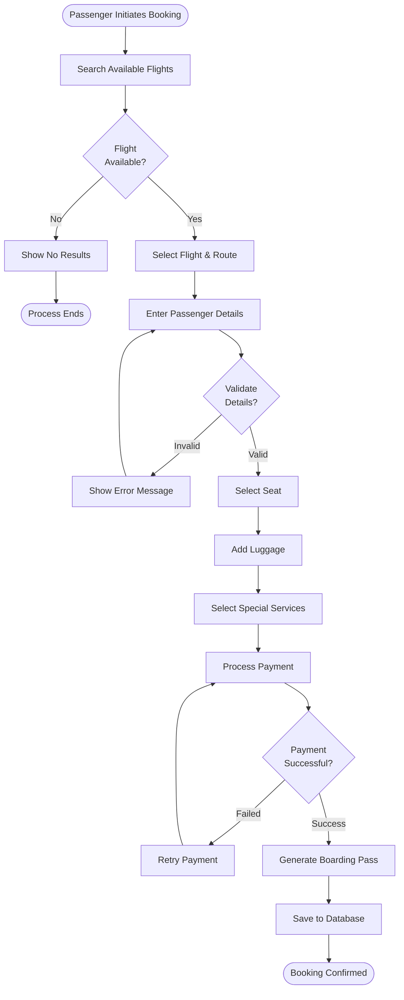
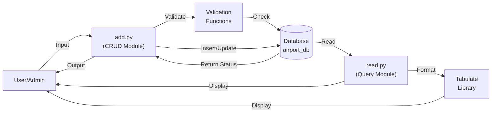
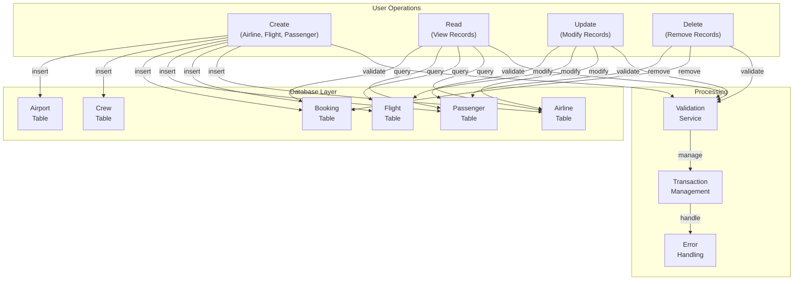

# Process & Data Flow Diagram - AMS

## Flight Booking Process Flow



## Data Flow Diagram - Flight Management



## System Data Flow (High Level)



## Database Transaction Flow

```
User Input
    ↓
Validation (date, format, constraints)
    ↓
Transaction Begin
    ↓
Execute Query (INSERT/UPDATE/DELETE)
    ↓
Check Constraints & Foreign Keys
    ↓
Success? ──Yes→ COMMIT → Persist to Storage
    │
    └─No→ ROLLBACK → Undo Changes → Error Message to User
```

## Data Dependencies

```
Airline
    ↓
Aircraft (owns aircraft)
Airline_Crew (employs crew)
    ↓
Route (has flights)
Flight (operated by aircraft & crew)
    ↓
Passenger (books flight)
Boarding Pass (issued for flight)
    ↓
Luggage (associated with boarding pass)
```

## Key Observations

### Current Flow Issues
1. **No middleware** - Direct DB access
2. **Synchronous operations** - Blocking calls
3. **No logging** - No audit trail
4. **No caching** - Every operation hits DB
5. **Limited error handling** - Basic try-catch only

### Recommended Improvements
1. **Add logging layer** - Track all operations
2. **Implement queue system** - Async processing
3. **Add caching** - Redis for frequently accessed data
4. **Event-driven architecture** - For complex workflows
5. **API layer** - For external integrations
