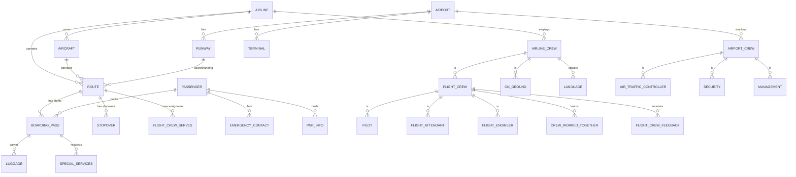

# Entity-Relationship Diagram (ERD) - AMS Database

## Database Schema Overview

## Core Tables

### 1. **AIRLINE**
- `IATA_CODE` (PK) - 2 char code
- `COMPANY_NAME` - Airline name
- `NUM_AIRCRAFTS_OWNED` - Fleet size
- `IS_ACTIVE` - Status
- `COUNTRY_OF_OWNERSHIP` - Country

### 2. **AIRCRAFT**
- `REGISTRATION_NUM` (PK) - Unique ID
- `MANUFACTURER` - Aircraft maker
- `MODEL` - Aircraft model
- `CAPACITY` - Passenger capacity
- `DISTANCE_TRAVELLED` - Total flight hours
- `MAINTENANCE_DATE` - Last service date
- `FK_AIRLINE` - Owner airline

### 3. **AIRPORT**
- `IATA_CODE` (PK) - 3 char code
- `AIRPORT_NAME` - Name
- `CITY`, `COUNTRY` - Location
- `ALTITUDE` - Height above sea level
- `TIME_ZONE` - Timezone offset
- `LATITUDE`, `LONGITUDE` - Coordinates

### 4. **ROUTE**
- `ROUTE_ID` (PK) - Unique identifier
- `SOURCE_AIRPORT_FK` - Origin
- `DESTINATION_AIRPORT_FK` - Destination
- `DATE` - Flight date
- `SCHEDULED_ARRIVAL`, `SCHEDULED_DEPARTURE` - Times
- `STATUS` - Flight status
- `FK_AIRCRAFT` - Aircraft assigned
- `FK_CAPTAIN`, `FK_CHIEF_ATTENDANT` - Crew leads

### 5. **PASSENGER**
- `AADHAR_NUMBER` (PK) - ID number
- `FIRST_NAME`, `MIDDLE_NAME`, `LAST_NAME` - Name
- `DOB` - Date of birth
- `GENDER` - Gender
- `EMAIL` - Email (unique)
- `NATIONALITY` - Country
- `SENIOR_CITIZEN` - Age category

### 6. **BOARDING_PASS**
- `BARCODE_NUMBER` (PK) - Unique barcode
- `FK_PNR_NUMBER` - Reservation ID
- `SEAT` - Seat assignment
- `FK_PASSENGER` - Passenger
- `FK_ROUTE` - Flight

### 7. **AIRLINE_CREW**
- `AADHAR_NUMBER` (PK) - ID
- `FIRST_NAME`, `LAST_NAME` - Name
- `SALARY` - Compensation
- `EXPERIENCE_YEARS` - Experience
- `DOB`, `GENDER`, `NATIONALITY` - Personal info
- `FK_EMPLOYER_AIRLINE` - Airline

### 8. **FLIGHT_CREW**
- `AADHAR_NUMBER` (PK) - References AIRLINE_CREW
- Inherits crew details
- Type: PILOT, FLIGHT_ATTENDANT, or FLIGHT_ENGINEER

### 9. **AIRPORT_CREW**
- `AADHAR_NUMBER` (PK) - ID
- `EXPERIENCE`, `SALARY` - Employment details
- `FK_AIRPORT` - Working airport
- `SUPERVISOR_FK` - Reports to

### 10. **LUGGAGE**
- `BAGGAGE_ID` (PK) - Tracking ID
- `FK_BOARDING_PASS` - Associated boarding pass
- `WEIGHT` - Bag weight
- `STATUS` - Checked/Carried

## Table Statistics

| Table | Purpose | Records |
|-------|---------|----------|
| AIRLINE | Airlines | Small |
| AIRCRAFT | Fleet | Small |
| AIRPORT | Airports | Medium |
| ROUTE | Flights | Large |
| PASSENGER | Travelers | Large |
| BOARDING_PASS | Bookings | Large |
| AIRLINE_CREW | Flight crew | Medium |
| AIRPORT_CREW | Ground staff | Medium |
| LUGGAGE | Baggage | Large |
| SPECIAL_SERVICES | Services | Medium |

## Normalization Issues

### Current State: 3NF (Mostly)
✓ No repeating groups
✓ No partial dependencies
✓ No transitive dependencies

### Issues Found:
1. **Spaces in column names** - Not normalized naming
2. **Inconsistent data types** - Mix of int, varchar, enum
3. **Poor foreign key naming** - `fk_to_airline_crew_Aadhar_card_number` (too long)
4. **Redundant fields** - `Distance Travelled` in both AIRCRAFT and ROUTE

## Improvement Recommendations

1. **Rename columns** - Use snake_case: `aadhar_number`, `first_name`
2. **Consistent types** - Use appropriate data types
3. **Simplify FK names** - Use `airline_id`, `crew_id`
4. **Remove redundancy** - Single source of truth
5. **Add timestamps** - `created_at`, `updated_at`
6. **Add soft deletes** - `is_deleted` flag
