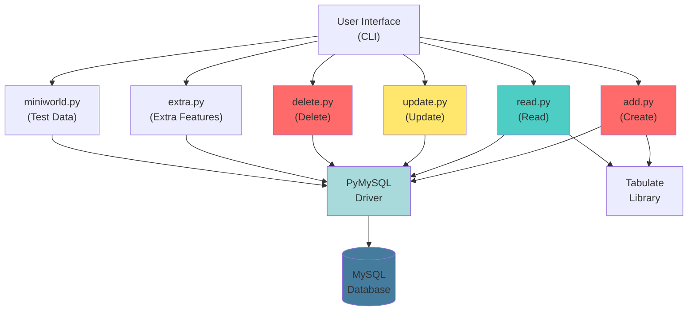

# Component Dependency Diagram - AMS

## Module Dependencies



## Dependency Analysis

### High-Level Dependencies

```
Presentation Layer (UI)
        ↓
Business Logic Layer (add.py, read.py, update.py, delete.py)
        ↓
Data Access Layer (PyMySQL)
        ↓
Database Layer (MySQL)
```

### Direct Dependencies

| Module | Depends On | Type | Coupling |
|--------|-----------|------|----------|
| add.py | PyMySQL | Direct | TIGHT |
| read.py | PyMySQL, Tabulate | Direct | TIGHT |
| update.py | PyMySQL | Direct | TIGHT |
| delete.py | PyMySQL | Direct | TIGHT |
| extra.py | PyMySQL | Direct | TIGHT |
| miniworld.py | PyMySQL | Direct | TIGHT |

### Cross-Module Dependencies

```
add.py ──┐
         ├──→ PyMySQL ──→ MySQL
read.py ─┤
update.py┤
delete.py┤
extra.py ┤
miniworld┘
```

## Issues Identified

### 1. **High Coupling**
- All modules directly import PyMySQL
- Direct database access from business logic
- No abstraction layer

### 2. **Circular Dependencies** (Potential)
```
add.py ←→ delete.py (both modify same tables)
add.py ←→ update.py (both modify same records)
```

### 3. **Hard to Test**
- Can't mock database without actual MySQL
- No dependency injection
- No interface contracts

### 4. **Code Duplication**
- Similar connection logic in each module
- Repeated validation patterns
- Duplicate error handling

## Refactored Dependency Structure (Recommended)

```mermaid
graph TD
    UI["User Interface"]
    
    SVCFACADE["Service Facade"]
    
    AIRLINE_SVC["AirlineService"]
    FLIGHT_SVC["FlightService"]
    PASSENGER_SVC["PassengerService"]
    BOOKING_SVC["BookingService"]
    CREW_SVC["CrewService"]
    
    REPO["Repository<br/>Pattern"]
    
    DAL["Data Access<br/>Layer"]
    
    DB[("MySQL<br/>Database")]
    
    UI --> SVCFACADE
    
    SVCFACADE --> AIRLINE_SVC
    SVCFACADE --> FLIGHT_SVC
    SVCFACADE --> PASSENGER_SVC
    SVCFACADE --> BOOKING_SVC
    SVCFACADE --> CREW_SVC
    
    AIRLINE_SVC --> REPO
    FLIGHT_SVC --> REPO
    PASSENGER_SVC --> REPO
    BOOKING_SVC --> REPO
    CREW_SVC --> REPO
    
    REPO --> DAL
    DAL --> DB
    
    style SVCFACADE fill:#a8dadc
    style AIRLINE_SVC fill:#e63946
    style FLIGHT_SVC fill:#e63946
    style PASSENGER_SVC fill:#e63946
    style BOOKING_SVC fill:#e63946
    style CREW_SVC fill:#e63946
    style REPO fill:#457b9d
    style DAL fill:#457b9d
    style DB fill:#1d3557
```



## Dependency Metrics

### Current System
- **Coupling**: HIGH (Every module talks to DB)
- **Cohesion**: LOW (Multiple responsibilities per module)
- **Testability**: LOW (Hard to unit test)
- **Reusability**: LOW (Tightly coupled to MySQL)
- **Maintainability**: LOW (Changes ripple through system)

### Refactored System
- **Coupling**: LOW (Services communicate through interfaces)
- **Cohesion**: HIGH (Single responsibility per service)
- **Testability**: HIGH (Can mock repositories)
- **Reusability**: HIGH (Services are independent)
- **Maintainability**: HIGH (Clear separation of concerns)

## Refactoring Steps

1. **Extract Interfaces**
   - `IAirlineRepository`
   - `IFlightRepository`
   - `IPassengerRepository`

2. **Create Service Classes**
   - Each domain gets a service
   - Services use repositories
   - Validation in services

3. **Implement Repository Pattern**
   - Abstract database access
   - Centralize query logic
   - Enable testing with mock data

4. **Add Dependency Injection**
   - Services receive repositories via constructor
   - Loose coupling
   - Easy to swap implementations

5. **Create Facades**
   - Single entry point for UI
   - Coordinate between services
   - Simplify client code
