# Use Case Diagram - AMS

## System Actors and Interactions

```mermaid
graph TB
    PASSENGER["👤 Passenger"]
    AIRLINE_STAFF["👔 Airline Staff"]
    AIRPORT_STAFF["👷 Airport Staff"]
    ADMIN["🔐 System Admin"]
    
    UC1["Book Flight"]
    UC2["Check Booking"]
    UC3["Cancel Booking"]
    UC4["Manage Airline"]
    UC5["Manage Aircraft"]
    UC6["Manage Routes"]
    UC7["Manage Crew"]
    UC8["Check-in Passenger"]
    UC9["Generate Reports"]
    UC10["Manage Airport"]
    UC11["Manage Runways"]
    UC12["System Configuration"]
    UC13["User Management"]
    UC14["View Flight Status"]
    UC15["Request Special Services"]
    
    PASSENGER --> UC1
    PASSENGER --> UC2
    PASSENGER --> UC3
    PASSENGER --> UC14
    PASSENGER --> UC15
    
    AIRLINE_STAFF --> UC4
    AIRLINE_STAFF --> UC5
    AIRLINE_STAFF --> UC6
    AIRLINE_STAFF --> UC7
    AIRLINE_STAFF --> UC9
    
    AIRPORT_STAFF --> UC8
    AIRPORT_STAFF --> UC10
    AIRPORT_STAFF --> UC11
    AIRPORT_STAFF --> UC14
    
    ADMIN --> UC12
    ADMIN --> UC13
    ADMIN --> UC9
    
    style PASSENGER fill:#e8f4f8
    style AIRLINE_STAFF fill:#fff4e6
    style AIRPORT_STAFF fill:#f0e6f8
    style ADMIN fill:#ffe6e6
```

## Use Cases by Actor

### 1. **Passenger Use Cases**

#### UC1: Book Flight
- Precondition: Passenger is registered
- Steps:
  1. Search available flights
  2. Select flight and date
  3. Enter passenger details
  4. Select seat
  5. Add luggage
  6. Choose special services
  7. Process payment
  8. Receive confirmation
- Postcondition: Booking confirmed, boarding pass issued

#### UC2: Check Booking
- Precondition: Passenger has booking reference
- Steps:
  1. Enter booking/PNR number
  2. View booking details
  3. Check flight status
- Postcondition: Booking information displayed

#### UC3: Cancel Booking
- Precondition: Booking exists, flight not departed
- Steps:
  1. Request cancellation
  2. Confirm cancellation
  3. Process refund
- Postcondition: Booking cancelled, refund processed

#### UC14: View Flight Status
- Check real-time flight status
- Gate information
- Boarding time

#### UC15: Request Special Services
- Wheelchair assistance
- Disability assistance
- XL seats
- Priority boarding

### 2. **Airline Staff Use Cases**

#### UC4: Manage Airline
- Add new airline
- Update airline details
- Track aircraft inventory
- Monitor active status

#### UC5: Manage Aircraft
- Add aircraft to fleet
- Update maintenance schedules
- Track distance travelled
- Assign to routes

#### UC6: Manage Routes
- Create new routes
- Schedule flights
- Add stopovers
- Assign aircraft and crew

#### UC7: Manage Crew
- Register pilots
- Register flight attendants
- Register engineers
- Track languages spoken
- Record experience hours

#### UC9: View Reports
- Flight statistics
- Passenger occupancy
- Revenue reports
- Crew utilization

### 3. **Airport Staff Use Cases**

#### UC8: Check-in Passenger
- Verify boarding pass
- Check luggage
- Assign baggage tags
- Confirm seat assignment

#### UC10: Manage Airport
- Add airport information
- Update runway status
- Manage terminals
- Track capacity

#### UC11: Manage Runways
- Create runway records
- Update runway status (Available/Assigned/Dysfunctional)
- Schedule runway usage

#### UC14: Monitor Flight Status
- Check departure status
- Monitor arrivals
- Track delays
- Coordinate with ATC

### 4. **System Admin Use Cases**

#### UC12: System Configuration
- Database backups
- System maintenance
- Performance tuning
- Security updates

#### UC13: User Management
- Create user accounts
- Assign roles/permissions
- Reset passwords
- Audit user actions

#### UC9: Generate Reports
- System usage reports
- Error logs
- Performance metrics
- Audit trails

## Extended Use Cases

### UC1: Book Flight (Detailed)

**Main Flow:**
1. System displays flight search form
2. Passenger enters search criteria (date, airports, class)
3. System returns available flights
4. Passenger selects flight
5. Passenger enters personal details
6. System validates details
7. Passenger selects seat
8. Passenger adds luggage
9. Passenger requests special services
10. System calculates total fare
11. Passenger authorizes payment
12. System processes payment
13. System generates boarding pass
14. System sends confirmation email

**Alternative Flows:**
- **A1**: Flight sold out → Show waiting list option
- **A2**: Invalid passenger details → Request correction
- **A3**: Payment failed → Allow retry
- **A4**: Seat unavailable → Suggest alternatives

**Exception Handling:**
- **E1**: Database connection error → Show error message, allow retry
- **E2**: Payment gateway timeout → Queue transaction for retry
- **E3**: Email delivery failed → Log error, provide backup confirmation

## User Roles and Permissions

| Role | Can Create | Can Read | Can Update | Can Delete |
|------|-----------|---------|-----------|----------|
| Passenger | ✓ Booking | ✓ Own Booking | ✓ Limited | ✗ |
| Airline Staff | ✓ All Data | ✓ All Data | ✓ All Data | ✓ Limited |
| Airport Staff | ✗ | ✓ Assigned Data | ✓ Status Only | ✗ |
| Admin | ✓ All | ✓ All | ✓ All | ✓ All |

## Use Case Priorities

**Critical (MVP):**
- UC1: Book Flight
- UC2: Check Booking
- UC14: View Flight Status

**Important (Phase 2):**
- UC4, UC5, UC6: Airline Management
- UC10, UC11: Airport Management
- UC8: Check-in

**Nice to Have (Phase 3):**
- UC3: Cancel Booking
- UC9: Reports
- UC12, UC13: Admin functions
