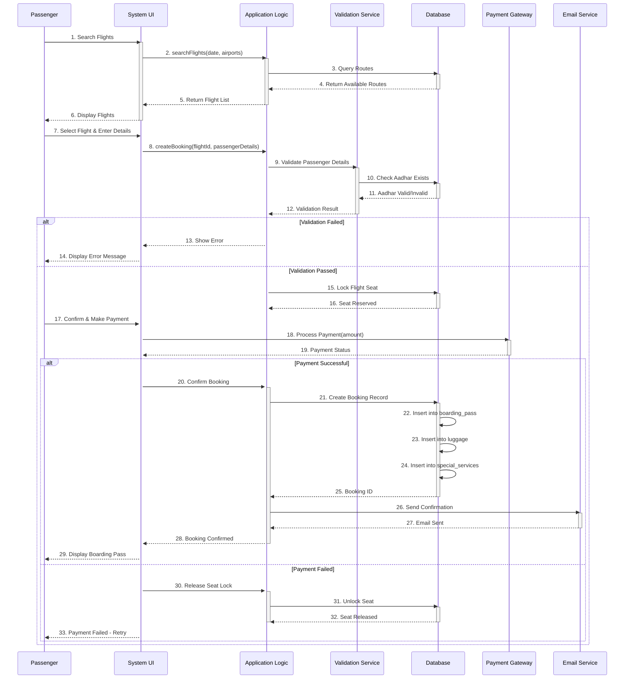
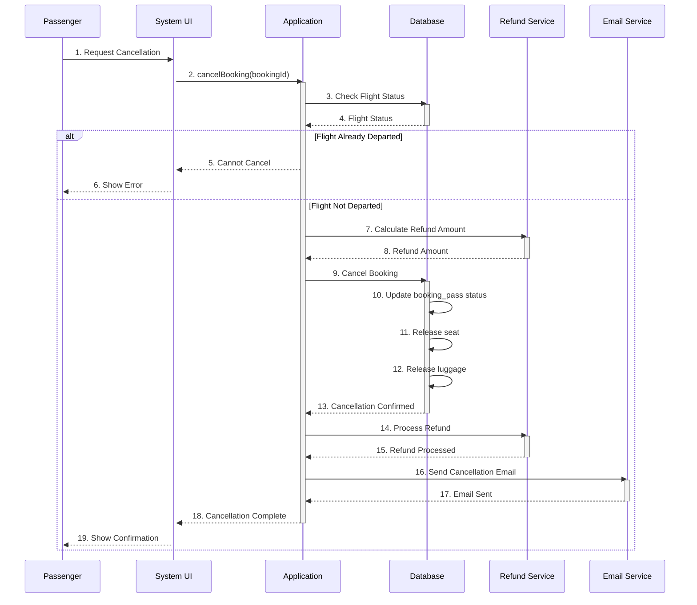
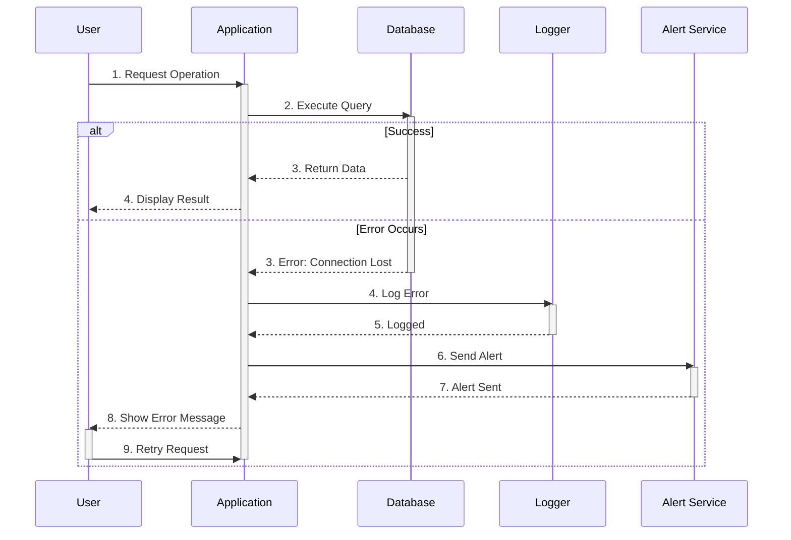

# Sequence Diagram - AMS Flight Booking Process

## Flight Booking Sequence



## Flight Cancellation Sequence



## Database Transaction Sequence

```mermaid
sequenceDiagram
    participant APP as Application
    participant TRANS as Transaction Manager
    participant DB as MySQL Database
    participant STORAGE as Physical Storage
    
    APP->>TRANS: 1. BEGIN TRANSACTION
    activate TRANS
    
    TRANS->>DB: 2. Start Transaction
    activate DB
    
    APP->>DB: 3. INSERT Booking Record
    DB->>DB: 4. Validate Constraints
    DB->>DB: 5. Acquire Row Locks
    DB-->>APP: 6. Insert Successful
    
    APP->>DB: 7. INSERT Luggage Record
    DB->>DB: 8. Check Foreign Keys
    DB-->>APP: 9. Insert Successful
    
    APP->>DB: 10. UPDATE Aircraft Status
    DB-->>APP: 11. Update Successful
    
    alt All Operations Successful
        APP->>TRANS: 12. COMMIT
        TRANS->>DB: 13. Commit Transaction
        DB->>STORAGE: 14. Persist to Disk
        STORAGE-->>DB: 15. Data Saved
        DB->>DB: 16. Release Locks
        DB-->>TRANS: 17. Commit Confirmed
        TRANS-->>APP: 18. Transaction Complete
        deactivate TRANS
        deactivate DB
    else Operation Failed
        APP->>TRANS: 19. ROLLBACK
        TRANS->>DB: 20. Rollback Transaction
        DB->>DB: 21. Undo All Changes
        DB->>DB: 22. Release Locks
        DB-->>TRANS: 23. Rollback Confirmed
        TRANS-->>APP: 24. Transaction Rolled Back
        deactivate TRANS
        deactivate DB
    end
```

## Error Handling Sequence



## Performance Considerations

### Current Flow Issues
1. **No caching** - Every search queries entire table
2. **No connection pooling** - New connection per request
3. **No pagination** - Returns all results
4. **No async operations** - Blocking calls
5. **No load balancing** - Single database

### Optimization Opportunities
1. **Add Redis cache** - Cache flight searches
2. **Connection pooling** - Reuse connections
3. **Pagination** - Limit result sets
4. **Async operations** - Non-blocking calls
5. **Database indexing** - Faster queries
6. **Read replicas** - Distribute read load
